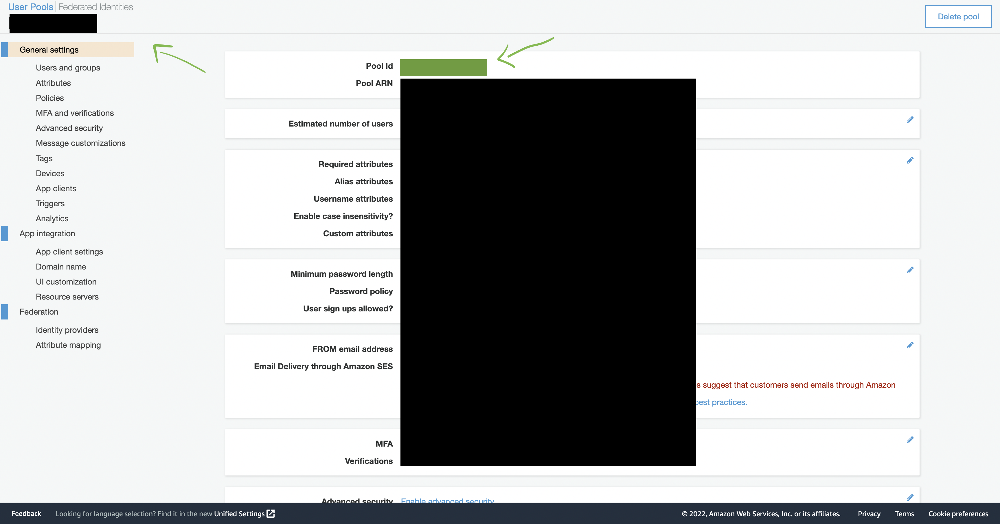
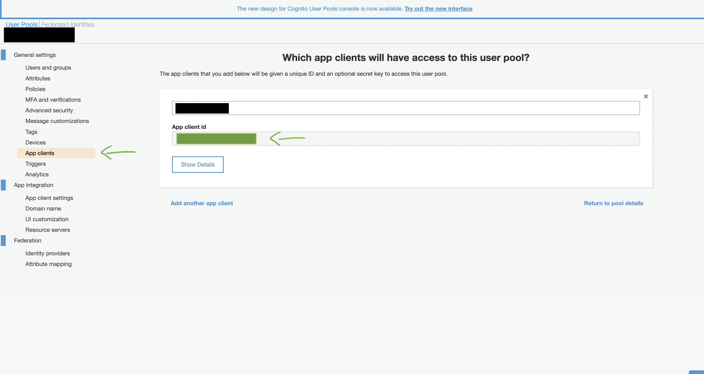

# Cognito & Amplify setup

**This repository shows the basic setup for authentication using Amazon's Cognito together with Amplify.**

To run this application:

1. run NPM install
2. Input your userpool ID & client ID (which can be found in your AWS console) in the src/environments/environment.ts file:

        
        export const environment = {
            production: false,
            cognito: {
                userPoolId: 'XXX-XXX',
                userPoolWebClientId: 'XXX-XXX',
            },
        };
        
3. Run ng serve

